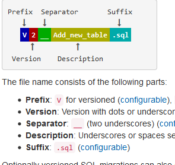

## h2 内存数据库

### 介绍
1、H2是一个用Java开发的嵌入式数据库，它本身只是一个类库，可以直接嵌入到应用项目中。
H2最大的用途在于可以同应用程序打包在一起发布，这样可以非常方便地存储少量结构化数据。
它的另一个用途是用于单元测试。启动速度快，而且可以关闭持久化功能，每一个用例执行完随即还原到初始状态。

```
h2
　|---bin
　|    |---h2-1.1.116.jar　　//H2数据库的jar包（驱动也在里面）
　|    |---h2.bat　　//Windows控制台启动脚本
　|    |---h2.sh　　//Linux控制台启动脚本
　|    |---h2w.bat　　//Windows控制台启动脚本（不带黑屏窗口）
　|---docs　　//H2数据库的帮助文档（内有H2数据库的使用手册）
　|---service　　//通过wrapper包装成服务。
　|---src　　//H2数据库的源代码
　|---build.bat　　//windows构建脚本
　|---build.sh　　//linux构建脚本
```

### h2的使用

1. maven 引用
```
    <dependency>
      <groupId>com.h2database</groupId>
      <artifactId>h2</artifactId>
      <scope>runtime</scope>
    </dependency>
```

2. application.yml配置
```
spring:
  datasource:
    platform: h2
    url: jdbc:h2:mem:demo
##  url: jdbc:h2:file:E:/H2/demo;DB_CLOSE_ON_EXIT=FALSE
    username: sa
    password:
    driver-class-name: org.h2.Driver

  h2:
    console:
      enabled: true
      path: /h2
      settings:
        trace: false
        web-allow-others: false

```

3. h2 网页控制台

访问地址: http://localhost:8080/h2

spring security 权限验证环境下，需要将h2端点全部免认证或认证通过后进入


## flyway 介绍


### 介绍
lyway是一款开源的数据库版本管理工具，Flyway可以独立于应用实现管理并跟踪数据库的变更，Flyway根据自己的约定，不需要复杂的配置就可以实现数据的Migrate。Migrations可以写成SQL脚本，也可以写在Java代码中，Flyway还支持Spring Boot。


### 原理


### 命名规范


版本号： 允许整数，小数，但是不允许重复,小于最新的版本号(默认)


### flyway 冲突解决

方案1： 退回版本
方案2： 人工校对版本信息，合并操作后，修改hash值